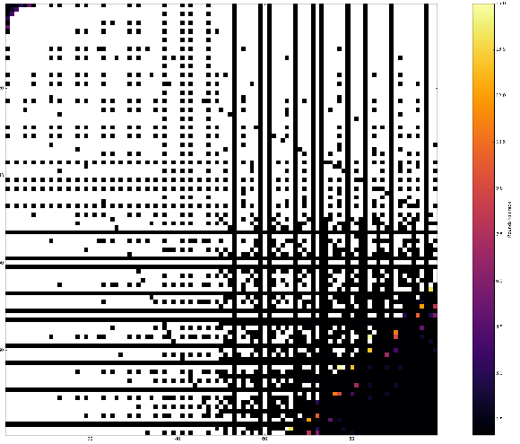

Every Friday, quizmaster [Oliver Roeder](https://twitter.com/ollie)
challenges his readers with his column, *The Riddler*. This Friday, the
[puzzle](http://fivethirtyeight.com/features/can-you-solve-the-impossible-puzzle/)
triggered me to do some programming. I have uploaded an 
[iPython Notebook](https://github.com/belteshassar/riddler-solutions/blob/master/20160402/solution.ipynb)
to GitHub detailing my solution and exploring some generalizations
on the topic. I hope to be able to update this repo more or less weekly so
feel free to follow it.
