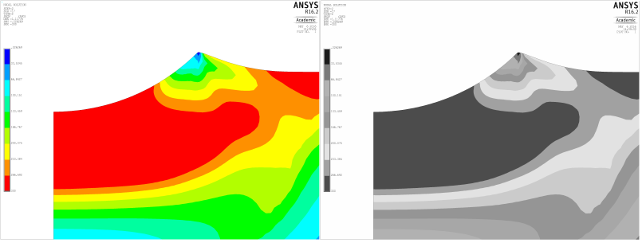
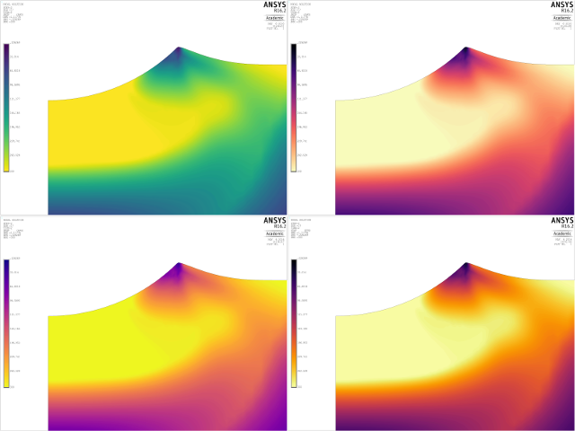

I do a fair amount of finite element analysis in my daily work. I use Ansys and usually Ansys APDL (or Ansys Classic, as it is sometimes called). The default colormap in Ansys APDL is lacking in several regards. It does not work well when printed in greyscale or for people with colorblindness. There are other problems as well, but being impossible to interpret in greyscale should really be enough to disqualify it from any work that might eventually get printed. I write this post mostly for my future self, but I decided to share it in case someone will find it useful.



Before going out and searching for an alternative to the built in colormap, we should probably list the characteristics of a good colormap. Thankfully, the people who build [matplotlib](http://matplotlib.org), a powerful plotting library for Python, have produced such a [list](http://matplotlib.org/devel/color_changes.html?highlight=colormap#default-heat-map-colormap) as well as four excellent colormaps that share these characteristics. Here is the list in short form:

* It should be **sequential** rather than diverging.
* It should be **perceptually uniform**.
* It should have a **perceptually uniform luminance ramp**.
* It should have a **variation in hue**.
* The variation in hue should produce reasonable results even for viewers with the more common types of **colorblindness**.

<a href="../assets/ansys_custom_cmaps_full.png" title="Click to view higher resolution">
</a>

# Changing the Colormap in Ansys

Having found the colormap you want to use, the question arises: How do I go about getting Ansys to use this new colormap? The help files are not very helpful in this regard and there is little information out there on the web so here is a step by step instruction.

1. Produce a colormap file for loading into Ansys. More on this later.
2. Issue the command `/cmap,<filename>,<extension>`.'
3. Set the desired number of contours (maximum 128) with `/cont,,ncont`.
4. All subsequent plots will now use your custom colormap.

# Creating a Colormap File

The format of the Ansys colormap files can be found by saving the active colormap to file by issuing the command `/cmap,active,cmap,,create` and clicking on `WRITE`. This will create a file `active.cmap` in the working directory, which looks like
```
  *** COLOR MAP CREATED FOR THE WIN32C DRIVER ***
      0   100   100   100
      1   100     0    61
      2   100     0   100
      3    63     0   100
      4     0     0   100
      5     0    63   100
      6     0   100   100
      7     0   100    63
      8     0   100     0
      9    70   100     0
     10   100   100     0
     11   100    57     0
     12   100     0     0
     13    80    80    80
     14    60    60    60
     15     0     0     0
  *** CONTOUR COLOR MAP CREATED FOR THE WIN32C DRIVER ***
      1     0    61   100
      2     0    93   100
      3     0   100    89
      4     0   100    74
      5    43   100     0
      6    89   100     0
      7    97   100     0
      8   100    84     0
      9   100     0     0

```
Each line contains four numbers. First an ordinal and then the RGB components on a scale from 0 to 100, where 100 is maximum. For example, green would be written as `0   100     0`. The 16 entries at the top define GUI colors. The following nine entries define contours. It is possible to expand this list up to 128 entries.

I have created [cmap files](../assets/cmaps.zip) based on the new matplotlib colormaps. Feel free to use them.
